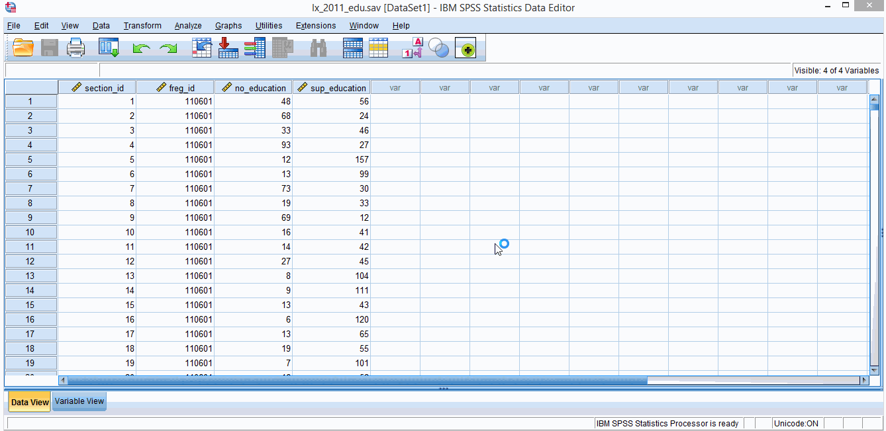
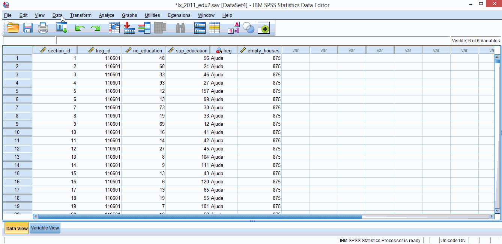
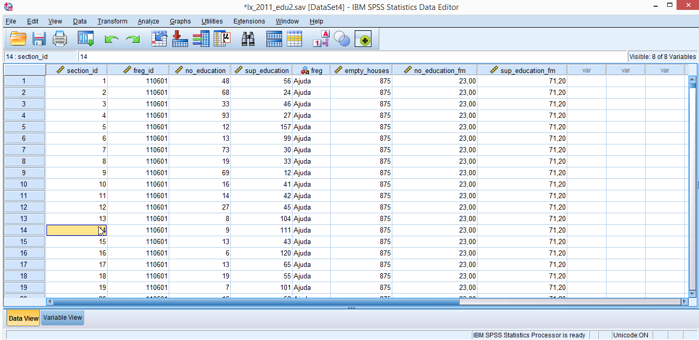
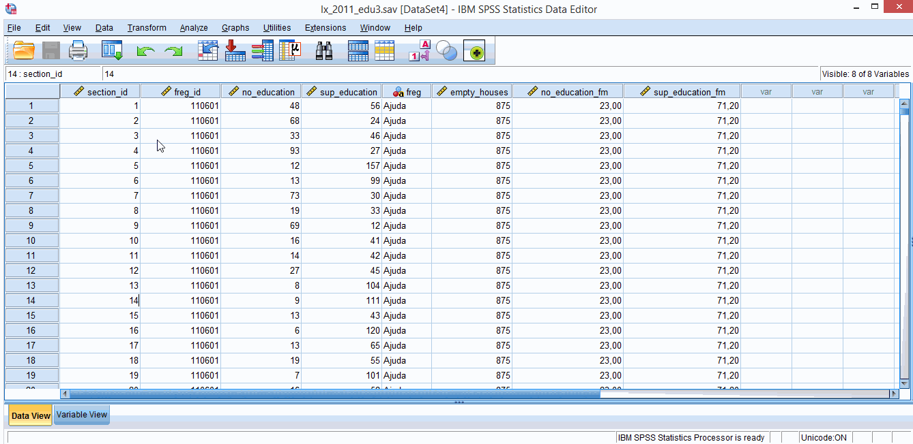
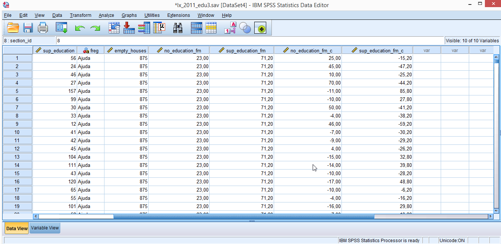
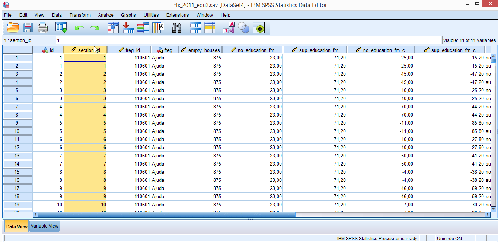
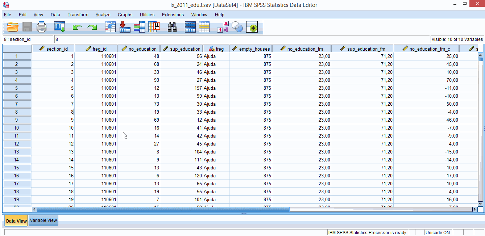

# 2. Tidying data   
You might be one of those humans that have access to nice, clean and organized data, ready to start your data analysis. If you are, you are missing out on the pleasures of tidying data and you can skip this section. If you are not, you either: (a) belong to the sister/brotherhood of those who delight in torturing data, or (b) you are at the bottom of the academic food chain and you don’t have anyone to do the scut work for you. Either way, mixed models require data to be organized in a specific format and the SPSS commands below might be of use to you. This is not an extensive list, but my own experienced-based choices of what might came in handy most often.  

We will be using some Portugese 2011 census data I’ve downloaded from: http://lisboaaberta.cm-lisboa.pt/index.php/pt/dados/catalogo-de-dados-abertos. I’ve edited the data files a bit to fit my purposes (but the data is not fake if that’s what you’re wandering – just some cuts and name changes here and there).  

You can download the datasets we’ll use from here: [lx_2011_edu.sav](data/ch2/lx_2011_edu.sav) and here: [lx_2011_house.sav](data/ch2/lx_2011_housing.sav).  

The **lx_2011_edu.sav** dataset includes the following variables:  
1. *section_id* - freguesia’s section identifier code (how do you translate freguesia to English?!? – parish ?!?)  
2. *freg_id* - parish identifier code  
3. *no_education* - number of Lisbon illiterate residents per section  
4. *sup_education* - number of Lisbon residents with higher education per section

The **lx_2011_housing.sav** dataset includes the following variables:  
1. *freg_id* - parish identifier code  
2. *freg* – parish name  
3. *empty_houses* – total number of empty houses in each parish  
&nbsp;
&nbsp;  
  
## 2.1. Data > Merge Files > Add Variables
If you are interested in mixed models you’ll probably know that data can have a nested structure (e.g., sections within parishes, students within schools, repeated observation within subjects) and that some variables refer to lower level units (sections) and other variables to higher level units (parishes).  
If you don’t know this already you’ll know it before the day is over. In practical terms, this means that your data files will have a lot of repetitive values within the same higher level units – typing repetitive data by hand is bit boring (unless you want to practice your mindfulness skills). 

For example, imagine that you have a data file with 200 rows, each row containing data for one student, and that these students belong to 20 different schools (10 children per school). Imagine that one of the variables you collected was the total number of students in each school. You can type 20 times the same number for every school, or you can create a dataset with variables referring exclusively to higher level units. This dataset would only have 20 rows. The only thing you need is to have a **“key” variable** (you’ll need more in some cases) to merge the lower level and higher level datasets. This key variable is usually an identifier variable (e.g., school id) that HAS to exist in both datasets.  
If you have large datasets, merging can save you a lot a time. Also, you might need to present higher level descriptive statistics and a dataset with just one row for each higher level group might come in handy.  

For the above mentioned datasets (**lx_2011_edu.sav** and **lx_2011_housing.sav**) the key variable is *freg_id*. What we want is to add parish housing data (higher level data) to section’s education data. Just imagine you add to type parish names for every one of the 1044 rows in **lx_2011_edu.sav** dataset (exciting!). Like this you just have to type 53 different names.  

Check **figure 2.1.1** to see the necessary steps. In the end you should get something similar to **figure 2.1.2**. You’ll need to have the **lx_2011_edu.sav** file opened (in front of you) because you will need to execute your commands from here (in SPSS language, **lx_2011_edu.sav** should be the active dataset). The instructions in **figure 2.1.1** assume that the **lx_2011_housing.sav** dataset is opened as well (this is not mandatory has you’ll see from the options in the dialog box).

**Figure 2.1.1**. *Merging data*.  
&nbsp;
&nbsp;

**Figure 2.1.2**. *Merged data*.  
&nbsp;

Just a note, in some SPSS versions you will need to sort the key variable in both datasets first (use **Data > Sort Cases** command). In more recent versions there is a checkbox for this task (checked by default) in the **Merge Data > Add Variables dialog box**, so if you’re lucky you don’t need to worry about this.
&nbsp;
&nbsp;

## 2.2. Data > Aggregate
To jump right into it, if you’re going to mixe model a lot, you’ll have to do a lot of mean centering (i.e., subtracting mean values). What this implies, is that you’ll *(a)* have to compute means across groups first (i.e., aggregate data) and then *(b)* subtract this value from a lower level score.  

Imagine for example, that you for some mysterious (but nevertheless valid) reason want to center your height on the mean height of your lab colleagues. For me, a 183cm human being, this would put my centered height at 183 – 170 = 13 (no I didn’t measure anyone in my lab, but 170cm seemed a really nice non-offensive mean height). Mean centered scores just tell you how many units a specific scores is above, or below some mean (usually a group mean or the mean of the entire sample). Maybe not the brightest example, but for now just retain that mean centering it’s a thing, and it’s a good thing. We’ll get back to this later.  

We will use the dataset from the previous example and add two new variables: *no_education_fm* (fm for freguesia mean) and sup_education_fm. These variables represent mean parish scores. The following instructions show you how to do this (**figure 2.2.1**), and you should get something like **figure 2.2.2**.

**Figure 2.2.1**. *Aggregating data*.  
&nbsp;
&nbsp;

**Figure 2.2.2**. *Aggregated data*.
&nbsp;
&nbsp;

Now you can use these new variables to mean center no_education and sup_education on parish mean scores (this is called **group-mean centering**). Just use the **Transform > Compute Variable** command. We will call these new variables *no_education_fm_c* (c for centered) and *sup_education_fm_c*. Instructions provided in **figure 2.2.3** show you how to mean center *no_education* variable (and get *no_education_fm_c*). Follow similar steps to mean center *sup_education*. In the end you should get something like the dataset in **figure 2.2.4**.

**Figure 2.2.3**. *Mean centering data*.
&nbsp;
&nbsp;

**Figure 2.2.4**. *Mean centered data*.
&nbsp;
&nbsp;

## 2.3. Data > Restructure
As you probably noticed, both *no_education* and *sup_education* refer to counts of Lisbon residents. You can think of these two variables as repeated measures of the same variable (*n_residents* - number of residents).  

As it is, the dataset is organized in what is called the **wide format** – each parish section data is presented in 1 row, with 2 columns for counts of residents belonging to 2 different categories (*no_education* and *sup_education*). You need data in this format if you want to do a repeated measures ANOVA, or to correlate no_education and sup_education. Usually this is the way you, or someone else for you, created the data file (it is faster to do it this way – less repetition). But for mixed models you need something different.  

To run mixed models on test scores in SPSS (and R, and many other statistical programs) data needs to be in the so called **long format** (**figure 2.3.1**). The dataset has too many columns by now to present a proper figure, but at least you can see that we now have duplicate *section_id* rows: 2 rows for every parish section (long format) instead of 1 row per section (wide format). **Figure 2.3.2** shows you how to convert your data from wide to long. If everything goes well you should get the number of residents (*n_residents*) in just one column (at the end of the dataset), and another column indexing the education level (*education*).

**Figure 2.3.1**. *Data in long format*.
&nbsp;
&nbsp;

**Figure 2.3.2**. *Restructuring data*.
&nbsp;
&nbsp;

This pretty much covers some of the basics of tidying your data in SPSS. You’ll probably use other generic **Data** and **Transform** commands as well, but those are probably more familiar to you.
