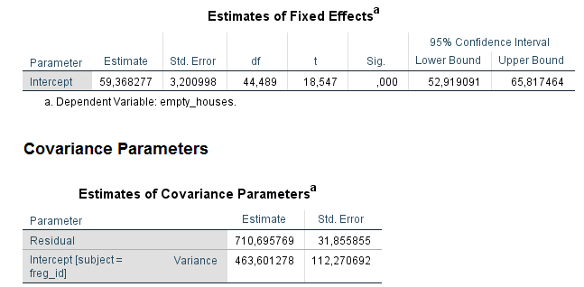

# 3. The Basic Two-Level Model   
For now let’s stick with datasets where the dependent variable is a continuous variable measured at the lowest level (level 1). You can use mixed models to analyse other types of data (e.g., binary, categorical – the so called generalized linear mixed models), or to analyse dependent variables measured at higher levels… but those are two different stories. For now we will keep it simple: continuous dependent variable, measured at level 1 and nested within level 2 units (two-level model).  

You will use a similar dataset to that of the previous section (**lx_2011_house2.sav**). You can download it [here](data/ch3/lx_2011_house2.sav). It also refers to 2011 housing and education data for the different Lisbon parishes. I downloaded the original data from [here](http://lisboaaberta.cm-lisboa.pt/index.php/pt/dados/catalogo-de-dados-abertos) as well, tidied it up a bit and computed some variables to speed up the process (just some **Data > Aggregate** and **Transform > Compute**, similar to what I showed you in the previous section).  

The **lx_2011_house2.sav** data set includes the following variables:  
*case_number* – it is always good to have a column indexing the row number of your original dataset in case you start fooling around with your data and later realize that you need the dataset sorted as it was in the beginning (if only life could be this simple!)  
*section_id* - section identifier (level 1 id)  
*freg_id* – parish identifier (level 2 id)  
*freg* – parish name  
*empty_houses* - number of empty houses in each section (level 1 dependent variable)  
*illiterate* - number of illiterate residents in each section (level 1 covariate)  
*illiterate_between* – mean number of illiterate residents in each parish (level 2 covariate)  
*illiterate_within* – illiterate centered on illiterate_between, or if you prefer, illiterate group mean centered scores (i.e., illiterate - illiterate_between; level 1 covariate)  
*illiterate2* - number of illiterate residents in each section centered on the sample grand mean (i.e., illiterate - 15.36; level 1 covariate)  
*illiterate2_between* - mean illiterate2 scores in each parish (level 2 covariate)
*old_buildings* – 1 if the % of parish buildings built before 1919 exceeds .25; 0 otherwise (level 2 categorical variable).  
&nbsp;

To compute the *illiterate_between* and *illiterate_within* variables you just need to use the same procedure as described in **section 2.2.Data > Aggregate**. It goes like this: first aggregate *illiterate* variable by *freg_id* to get *illiterate_between*, and then compute *illiterate_within* by subtracting illiterate_between from illiterate.  

To compute *illiterate2* you need to subtract the *illiterate* grand mean (sample mean) from *illiterate* (this is called **grand mean centering**). To get the sample mean (THE grand-mean) of *illiterate* scores go to **Analyze > Descriptive Statistics > Descriptive**. You then aggregate *illiterate2* by *freg_id* to get *illiterate_between2* (**group mean centered scores**).  

Wrapping up, all **variables that take the same value for each section within a parish are level 2 variables**, the rest are level 1 variables (identifier variables excluded).  

This dataset has data for 1054 sections (**_M_ = 1054**; number of rows), distributed between 53 different parishes (**_N_ = 53**) – that gives an average of 19.89 sections per parish (**mean _n_ = 19.89**). This M, N, n notation is the one used by Snijders & Bosker (2012). You will see different notations elsewhere.  
&nbsp;
&nbsp;

## 3.1. The null random intercept model
**Figure 3.1.1** shows you the distribution of empty houses across sections and parishes. There’s a black line there, crossing the vertical axis at the *empty_houses* sample mean (**47.64**; go to **Analyze > Descriptive Statistics > Descriptives** to get this value). There are also smaller coloured lines that represent empty_houses parish means.  

**Figure 3.1.1**. *Distribution of empty houses across sections and parishes*.  
&nbsp;
&nbsp;

Let’s start this by first fitting a **null model** to empty_houses. This is a model with *empty_houses* as a dependent variable, but with **no independent/predictor variables**.  

Follow the instructions of **figure 3.1.2** to do it. We will skip a lot of the menus in the dialog boxes and leave as default most of the settings. The dialog boxes can feel a bit overwhelming at first but you’ll eventually get the hang of it. Default options in statistical software are like those little spiders on your kitchen cabinets. You don’t know how they got there, they make you feel that you have to do something about it, but in the end you just get used to them and leave them alone.  

**Figure 3.1.2**. *Estimating a null mixed model*.  
&nbsp;
&nbsp;

You should be looking at your output file by now. There is a lot of information there. I’ll ignore some of it for the moment and guide you through some basic details.  

Take a look at the estimates of fixed effects and covariance parameters (**figure 3.1.3**).  

**Figure 3.1.3**. *Fixed and random null model estimates*.  
&nbsp;
&nbsp;

I want you to check 3 things:   
1. the **intercept parameter estimate** (fixed effect); let’s just call it **intercept**; it equals **59.37**   
2. the **intercept variance estimate** (random effect); let’s call it **_σ_between**; it equals **463.60**   
3. the **residual variance estimate**; let’s call it **_σ_within**; it equals **710.70**  

These are the 3 parameters your model estimated, and this number equals the total number of parameters displayed in the first table of your output (**figure 3.1.4**). If you had run a linear regression null model you would only have estimated 2 effects: an intercept parameter estimate and a residual variance estimate.

**Figure 3.1.4**. *Number of null model estimated parameters*.

The intercept parameter estimate (fixed effect) is what the model estimates the mean *empty_house* scores to be in the population of parishes from where our data was taken. The other 2 estimates are measures of unexplained variance.  
&nbsp;
&nbsp;

### Unexplained what?
The null model you ran partitioned the variance of *empty_houses* scores (our dependent variable) in within section variance (level 1 variance; **_σ_within**) and between parish variance (level 2 variance; **_σ_between**).  

We can use **figure 3.1.1** to get an intuitive notion of what these variances are. In this figure the mean distance of each small line (mean parish scores) to the big black line (sample overall mean) gives you a proxy of level 2 variance. If the little lines are very far away from the big line, there’s a lot of level 2 variance. The lower the models estimates level 2 variance, the better you know about why empty houses mean scores vary between parishes.  

The mean distance of each circle to the corresponding parish mean (little lines) gives you a proxy of level 1 variance. If these distances are big, there is a lot of level 1 variance in our dependent variable. Meaning that empty house numbers within each parish vary a lot for reasons (variables) we haven’t accounted for.  

If you had run a null regression model (no mixed stuff), the estimated intercept would equal the *empty_houses* sample mean (**47.64**), and you would only have one type of residual. These residuals are computed from the difference between *empty_houses* scores and the sample mean. If there is only one type of residual there is only one type of variance. This variance approximates the total variance estimated by the null mixed model (sum of **_σ_within** and **_σ_between**) – why they are not exactly the same involves an elaborated mathematical explanation that you will have to find somewhere else because it is beyond my reach.  

By the way, you can actually use the **Linear Mixed Models dialog boxes** to do your linear models (ANOVAs, regressions, ANCOVAs, etc.). Just restore the **Linear Mixed Models: Random Effects dialog box** to how you first found it. This will remove the random effects of your model, and just leave you with fixed effects (as in ANOVAs, regressions, ANCOVAs, etc.). This just shows you that linear models and linear mixed models are like close cousins – do you prefer the square kind of cousin? Or do you prefer the flexible, shades of grey kind of cousin? With this small trick, if you like to experiment with your data, you can shift between linear models and linear mixed models to compare model estimates – if estimates don’t differ that much maybe you don’t need a mixed model after all (eat that Reviewer 1!).  
&nbsp;
&nbsp;

### Intraclass Correlation
So what does the partitioning of variance in level 1 (within groups) and level 2 variance (between groups) give you?  

It gives you the famous **Intraclass Correlation** (**ICC** for shorts). ICC is a measure of dependency of two observations within the same grouping unit. In our example here, you can think of it as a measure of how similar *empty_house* scores are within the same parish.  

You can compute the ICC by dividing level 1 variance (**_σ_within**) by the total variance (**_σ_within** + **_σ_between**). The null model total variance equals 710.70 + 463.60 = 1174.3, and so the ICC equals 710.70 / 1174.3 = **.61**.  

How high is a high ICC? Well, it… depends. From my experience with school data (students nested in schools kind of data), ICCs close to .20 are high and not that common. In longitudinal data (repeated observations nested within subjects) ICCs can go much higher. Imagine you measure your mood daily. Your mood score for today will be highly relate with tomorrow’s mood score and so on and so forth (high ICC). If your mood scores vary completely at random on a daily basis, then maybe, just maybe, you might need some help – who knows, maybe statistics will be the life-anchor you’ve been searching for.  

Another way to look at the **ICC** is as **measure of unexplained variance at each level**. Here the ICC is .61, so **61% of the unexplained variance is due to within parish differences** and **39% (100% - 61%) is due to between parish differences**. This suggests that differences in empty house scores have more to do with section characteristics than to parish characteristics.  

Ok. Let’s make this more interesting and add some predictors to our model.  
&nbsp;
&nbsp;

## 3.2. Adding a fixed predictor to the random intercept model
Let’s test whether or not the number of empty houses is related to number of illiterate residents (why? because…). Just follow the instructions in **figure 3.2.1**. Hereafter I’ll refer to this model as **model 1**.

**Figure 3.2.1**. *Estimating fixed predictor effects*.  
&nbsp;
&nbsp;

The first table of the output refers to the number of parameter estimates (**figure 3.2.2**). Compared to the null model, we now estimated 1 more parameter – the fixed effect of *illiterate* covariate. That makes **2 fixed effects**, plus **1 random effect** (intercept variance), plus the **residual variance**.

**Figure 3.2.2**. *Model 1 parameters*.  
&nbsp;
&nbsp;

Now let’s look at the fixed effects tables (**figure 3.2.3**). There’s an ANOVA like table (with F tests; top) and a regression like table (t tests; bottom). Look at the *p* value of the *illiterate* fixed effect in both tables – it’s the same (**.014**). This will not always be the case, but we'll get back to this later when we find a difference (believe me, we will).  

One advantage of reporting regression coefficients is that they allow a practical interpretation of the *illiterate* effect: an **increase in 1 illiterate resident** in a parish section is associated with a **decrease (negative estimate) of .13 empty houses** (**-.128** to be more precise). So you need about 8 illiterate residents to take an empty house out of the market (bad joke?).  

The **intercept fixed effect** was estimated as **61.14**. **Intercept** regression coefficients (coming from a mixed model or not) represent the **estimated mean score** of the dependent variable when **all predictor variables are 0**. So here, 61.14 is the model estimated mean number of empty houses for sections with 0 (zero) illiterate residents.  

**Figure 3.2.3**. *Model 1 fixed effects’ estimates*.  
&nbsp;
&nbsp;

### How do random intercept models look like?
Take a look at the **figure 3.2.4**. It’s a plot of predicted number of empty houses for 6 parishes. Did you check the **Predicted value – Predicted Values & Residuals checkbox** in the **Linear Mixed Models: Save dialog box**? If you did, there’s a variable in your dataset somewhere, whose name starts with *PRED_*. What do you see?  

**Figure 3.2.4**. *Model 1: number of empty houses predicted from the number of illiterate residents for 6 parishes starting with letter A*.  
&nbsp;
&nbsp;

One thing you can notice is that **all lines are parallel**. If you look at the regression equations boxes, you’ll find that they all have this common part: **-.13*x**. This part of the equation defines the slope of the lines. The minus sign tells you that the lines have a negative slope (they go down from left to right). The same slope (-.13) *"makes them lines parallel"*!  

Does **-.13** ring any bell? -.13 (-.128 to be more precise) is the estimated fixed effect of the *illiterate* covariate that we talked about above (**figure 3.2.3**). It’s a **fixed effect** because the **effect of _illiterate_ is the same for all parishes** (our level 2 unit): the -0.13*x is in every regression equation (it’s fixed!).  

The other thing I want you to see is that all lines cross the vertical axis at different points. Lines cross the vertical axis when the predictor variable equals 0. Does this ring another bell? An intercept is an estimated value of the dependent variable when the predictor(s) variable(s) take(s) the value of 0. Every parish gets a different intercept. In the random intercept model, intercepts are allowed to randomly vary from an overall value- the intercept fixed effect (**61.14**; *figure 3.2.3*).  

How much the different intercepts differ from the overall estimated mean is given by the estimated variance of the random effect (remember the **_σ_between). For this model, this is estimated at **453.05** (check the last table of your output; **figure 3.2.5**). You can use some Bayesian statistical procedures (that I have no clue about) to identify which parishes’ intercepts significantly differ from one another (in terms of the number of empty houses), if that's your thing.  

**Figure 3.2.5**. Model 1: between and within parish variance.  
&nbsp;
&nbsp;

### How much variance was explained by the illiterate covariate?
We can compare the estimated variances in model 1 (**figure 3.2.5**) with the estimated variances in the null model (**figure 3.1.3**) to get a glimpse at the (*empty_houses*) variance explained by the illiterate predictor.  

To recap, null model: **_σ_between** = 463.60 (level 2), **_σ_within** = 710.70 (level 1). In model 1 we got: **_σ_between** = 453.05 (level 2), **_σ_within** = 707.87 (level 1). So we only slightly decreased level 1 variance from 710.70 to 707.87. This corresponds to a **0.39%** decrease (very very little) in level 1 variance [(710.70 - 707.87) / 710.70], and a **2.28%** decrease [(463.60 - 453.05) / 463.60] in level 2 variance. So little explained variance by a statistically significant predictor!!! Lo and behold the magic of big datasets. One thing they do well is that they do know how to decrease those dammed *p* values.  
&nbsp;
&nbsp;

## 3.3 Disaggregating within and between groups covariate effects.
Do you remember the story about the ecological fallacy and the Simpson paradox Wikipedia page (section 1)? A covariate can show a completely different effect within or between groups. To test whether this is happening to our covariate we need to disaggregate the within and between group effects.  

You can do this by using an *illiterate* aggregate variable that has the same value for every section within each parish (remember the **Data > Aggregate** commands to compute mean values?). In our dataset this variable already exists: I’ve named it *illiterate_between* (it’s just the parish *illiterate* mean scores). This variable is a level 2 variable that will model the between groups effect, while the *illiterate* scores (level 1 variable) will model the within group effect.  

Let’s call this model, **model 2**. It is still a random intercept model that will now have 2 predictors (instead of one as in model 1), plus the intercept, plus the level 2 variance, plus the level 1 variance (5 parameters in total). There’s no gif for this model – I’m taking off the training wheels for this one (look how much you’ve grown). Just:  
1. add *illiterate_between* to the **Covariate(s) box** in the **Linear Mixed Models dialog box**   
2. then click on the **Fixed button** on your right   
3. and add the main effect of **illiterate** and **illiterate_between** to the **Model box**   
4. the rest do as you’ve done in model 1 (**figure 3.2.1**)   

The first table of the output shows you the 5 parameters you estimated (the ones I just mentioned). By now you’ve realized that I’ve been systematically ignoring the Information Criteria table. We’ll get there. But I’ll throw you a candy – it relates with the model goodness of fit and it will allow us to compare different models to see if one is “better” than the other (better as in explaining more variance; better as in giving you a better story to tell about why your dependent variable varies from case to case).  

**Figure 3.3.1** shows the fixed parameter estimates of model 2. So what we got? We got significant main effect of *illiterate* (*p* = .025) and a non-significant effect of *illiterate_between* (*p* = .171) – the *p* values of the F tests and t tests are the same again.  
&nbsp;

**Figure 3.3.1**. *Model 2 fixed effects’ estimates*.  
&nbsp;
&nbsp;

The regression estimate of the **_illiterate_ fixed effect** is *-.118* and the **_illiterate_between_ fixed effect** estimate is *-.539*. Take a look at **figure 3.3.2**. You can see the **-.12*x** in every regression line (-.118 rounded). This illustrates the within group effect of the number of illiterate residents. 

**Figure 3.3.2**. *Model 2: within group effects of illiterate covariate*.  
&nbsp;
&nbsp;

Now look at **figure 3.3.3**. This plot illustrates the relation between group mean illiterate scores and group mean predicted empty houses scores. To plot this you need to compute a new variable first. Just use **Data > Aggregate** to compute the group (freg_id) mean *PRED_* scores of this model (i.e., the group mean predicted empty houses scores). To get the *PRED_* scores you need to click the **Save button** in the **Linear Mixed Models dialog box**, and then check the **Predict values checkbox (Predicted Values & Residuals)**, before running your model.  

If you didn’t change the default name you should have a new *PRED_1_mean* variable (after **Data > Aggregate that is**). You can see this variable takes the same value for every section within the same parish. Because we want to plot only 1 data point for the 53 different parishes we need to identify and select just 53 rows of our +1000 row dataset. Follow the instructions of **figure 3.3.4** to get this selection and then plot *PRED_1_mean* against *illiterate_between* scores (don’t forget to remove the selection filter after you finished the plot).

**Figure 3.3.3**. *Model 2: between group effects of illiterate covariate*.  
&nbsp;
&nbsp;

**Figure 3.3.4**. *Selecting only level 2 mean scores*.  
&nbsp;
&nbsp;

The line in **figure 3.3.3** has a slope of *-.66* (a mean increase of 1 illiterate resident in a parish – one more illiterate in each section for example - associates with a mean decrease of .66 houses in the corresponding parish). Do you find any relation between **-.66** and the estimated regression estimates of illiterate (**-.118**) and illiterate_between (**-.539**; **figure 3.3.1**). No? Yes? Take a second look.  

If you add **-.118** and **-.539** together you get **-.657**. Round it to .66 and you get the **between groups effect** of *illiterate* scores. Another way to look at this, is that the **_illiterate_between_ effect** in this model gives you the **difference between the within group and between group effects**. Because this estimate (-.539) has an associated *p* value, you can use it to test whether the within and between group effects differ. Here that *p* value is *p* = .171. As such, within and between subjects are not statistically different. Ecological fallacy put to rest!  

Summing, the within and between group effects are similar (non-significant difference), and the illiterate (within) effect is different from zero. But what about the between groups effect? Is it significantly different from zero? Well, we’ll have to create a new model for that.  
&nbsp;

### Disaggregating within and between groups covariate effects: Round 2.
Let’s do **model 3**. Do everything you did to estimate model 2, except that **instead of** adding the *illiterate* variable to the model you **add the** *illiterate_within* variable (*illiterate* scores centered on the group mean).  

Take a look at model 3 estimates (**figure 3.3.5**) and compare them with model 2 estimates (**figure 3.3.2**). The *illiterate_within* estimate in model 3 is exactly the same as in the *illiterate* estimate in model 2 (**-.118**). The *illiterate_between* estimate in model 3 is **-.656** (the slope in **figure 3.3.3**). The associated *p* value indicates that the between group effect is only marginally significant. Although much further from 0 than the *illiterate_within* estimate (more steep slope), the very high standard error “eats” away its statistical significance. Take a look at *figure 3.3.3* again. The line is steep but most points fall far from the regression line. 

**Figure 3.3.5**. *Model 3 fixed effects’ estimates*.  
&nbsp;

Summing up, **model 2 tests the difference between within and between group effects** (and whether the within effects differs from zero); **model 3 tests whether the within and between group effects differ from zero**. None is better than the other, it depends on what you want to test.  

After all this, if there is no difference between both effects you may decide to drop one variable and fall back to model 1 with only the *illiterate* global effect (**figure 3.2.3**). Decisions, decisions… as much as you can, base your choices in theoretical reasons. We are all *p* hackers on the inside. Acknowledging it will help you make better life choices. More on the selection of models later.