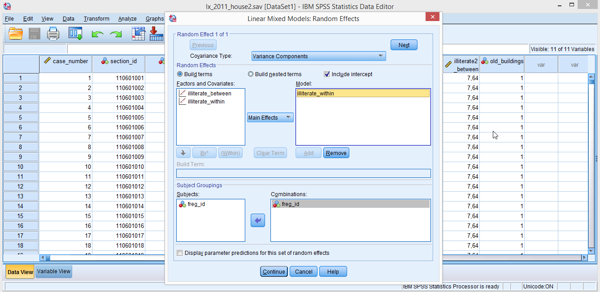
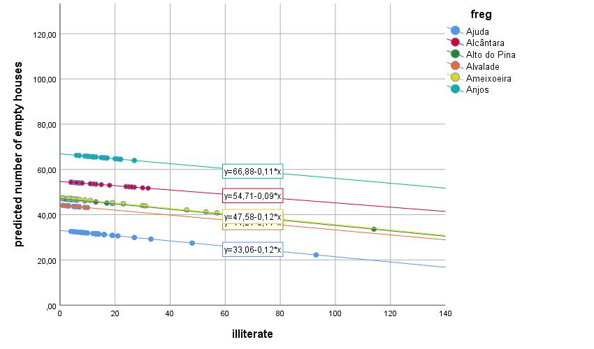
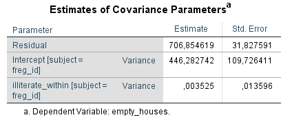

# 4. The Random Intercept Random Slope Model
So far we have assumed that the effect of the *illiterate* covariate is the same across all parishes (remember all those parallel lines in **figure 3.3.2**?). What happens if we let the slopes vary? That is, if we let the effects of the number of illiterate residents vary from group to group?  

Let’s go create **model 4**. Just follow the same steps you took for model 3. Go back to **figure 3.2.1** and to the instructions on the beginning of **section 3.3** if you feel lost. The only difference is that in the **Linear Mixed Models: Random Effects dialog box** you have to add *illiterate_within* to the **Model box** (**figure 4.1**). In the **Linear Mixed Models: Save dialog box** don’t forget to ask for **Predicted values (Predicted Values & Residuals).**  
&nbsp;

**Figure 4.1**. *Adding a random slope*.  
&nbsp;  

This model has 3 fixed effects (intercept, **illiterate_within**, **illiterate_between**), 2 random effects (random intercept variance and random slope variance), plus the residual variance. Let’s start by looking at the plot of the predicted (*PRED_*) values first (**figure 4.2**).  

  

**Figure 4.2**. *Model 4: Predicted mean number of houses (random intercept and random slope model)*.  
&nbsp;

What do you see? The lines look pretty much parallel, but in fact they aren’t (compare **figure 4.2** with **figure 3.3.2**). In **figure 4.2** you see that the last part of the regression equations (slopes), although showing very similar values are in fact different. The slopes for these parishes range from **-.09** to **-.12**, because we allowed the effects of *illiterate_within* to vary between parishes (that’s what random means in modelling language – we let things vary). They end up not varying that much, but we had to take a look.  

Please check the covariance estimates table (**figure 4.3**). We now have 3 estimates there, instead of just 2 has in the previous models. The first 2 are old acquaintances of ours, the last one is a new friend – hello **_σ_slope**, this is us; us, this is **_σ_slope**.  

This estimate tells you how much *illiterate_within* effects vary from parish to parish. The estimate is very close to 0 (**.0035**). Meaning that illiterate effects don’t vary that much (almost nothing) from parish to parish as you’ve seen from the almost parallel lines in **figure 4.2**. 
&nbsp;

**Figure 4.3**. Model 4: variance estimates.  
&nbsp;

## 4.1 Comparing models: the Information Criteria table
So, we started with model 3 and then added a random slope to our model (model 4). We have the same fixed predictors in both models (*illiterate_between* and *illiterate_within*), but one more random effect in model 4. Can we test whether model 4 is “better” than model 3. YES WE CAN!  

Go back to the output of model 3 (where’s that? Nevermind…). The different indices in one **Information Criteria** tables are all similar to one another. These raw values in themselves don’t tell us much, but we can compare Information Criteria values from different models to see if adding/removing fixed and random effects improves model fit. The lower these indices are, the better. That is, a model with lower indices is a better fit to your data than a model with higher indices (better fit equals to explaining better why the dependent variable scores vary from case to case).  

Getting back to our models 3 and 4. Let’s look at the first value of Information Criteria tables: **-2 Restricted Log Likelihood** values, aka -2LL, aka **Deviance**. Because models 3 and 4 have the same fixed effects (intercept, *illiterate_within*, *illiterate_between*) and differ only on the random part (model 4 has 1 random slope that is absent in model 3) we can use the difference of deviance values to test whether one model fits better than the other.  

For model 3, **deviance = 10024.563**; for model 4, **deviance = 10024.482**. If you subtract model 3 deviance from model 4 deviance you get *.081* (adding parameters is supposed to lower information criteria). This difference has a chi-square distribution. The degrees of freedom of this distribution equal the difference in the number of parameters (1 in this case – the random slope). What this means is that you can use a chi-square test to test whether the goodness of fit of 2 models differ. Repeat after me:  
1. compute the deviance difference  
2. subtract the number of parameters  
3. open an excel file and type this formula in a cell: **=INV.CHIQ(_df_;.95)**; there’s probably a way to do this using a SPSS syntax file but so far I’m stuck with excel   
4. where df should be replaced with the difference in the number of parameters- 1 in this example; if the formula throws an error try swapping .95 with ,95.  

For a chi-square distribution with df = 1, this value is **3.84**. If the deviance difference we found (**.081**) was higher than this, then the 2 models would differ in their fit to the data. It is not, so adding the random slope to model 4 adds pretty much too… nothing! You might have expected this, when we saw that the **_σ_slope = .0035** (~0) and the lines in the figure were almost parallel.  
&nbsp;  

### REML and ML
In the **Linear Mixed Models dialog box** where we specify our models, there’s a button there (**Estimation**) that gives you access to the **Linear Mixed Models: Estimation dialog box**. Using an auto-mechanics analogy, this is what is under the hood. You can choose two estimation options in the **Method section**: REML or ML. REML is the default. I can’t explain how they differ (yet!). The explanation gets a bit technical and I don’t understand it well enough to try and explain it to you in friendly terms.  

As far as I have been "told", REML is better when sample sizes are small (how small is small… well… *“Have you noticed how good the weather has been lately?”*). ML is better when … (*“It feels almost like summer don’t you think?”*). When the sample sizes are big, REML and ML are expected to give very similar results. That’s another advantage of BIG data samples – you can pretty much hit buttons at random that results will always look nice.  

On a more serious note. The take home message is:
1.	If you want to **compare** the fit (compare deviances) of models (from the same data!) with the **same fixed effects but with different numbers of random effects**, you should **use REML** to estimate both models;
2.	if you want to **compare** the fit of models (from the same dataset!) with the **same random effects but with different fixed effects**, you should use ML instead. The reason for this is that… (*“Do you think it will rain next week?”* … got you!).  

Snijders & Bosker (2012) provide a set of guiding rules on how to use deviance tests to build your models and decide which variables to keep/drop. The list is long and I’ll eventually summarize it here, but for now I’ll just point the way. Start with fixed effects and interactions that are theoretically meaningful and then add/test one random slope at a time. Don’t go adding a lot of random effects to your models at once (this is one I memorized), it will likely cause SPSS to start throwing errors and warnings at you. There’s a limit to how many random effects you can have- there’s a formula for that somewhere in Snijders & Bosker (2012) (as you probably noticed, everything I don’t know and/or can’t explain – Snijders & Bosker do and can).