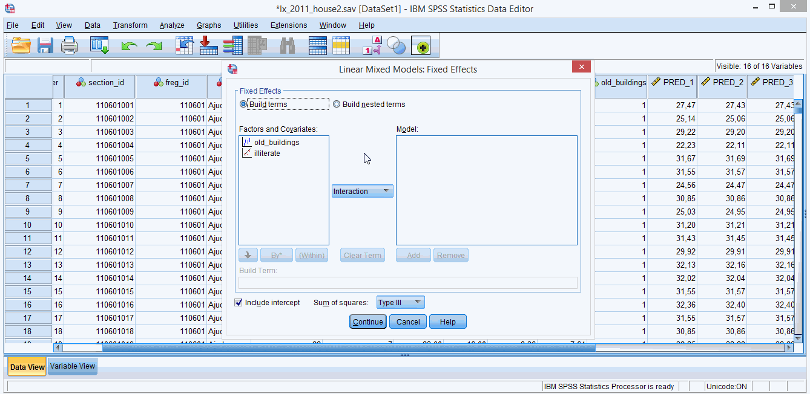
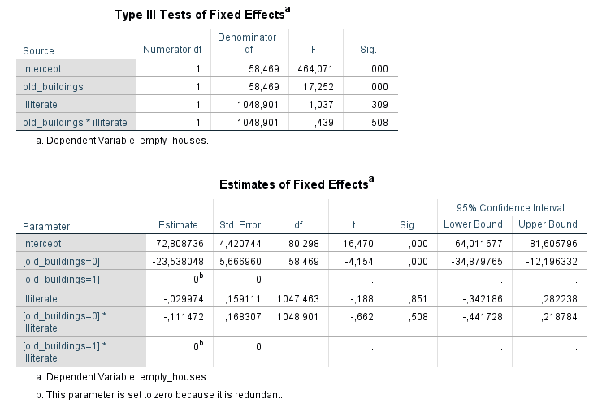
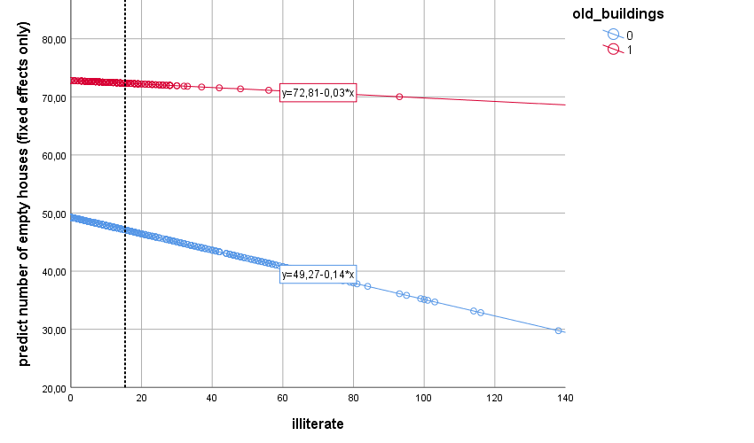
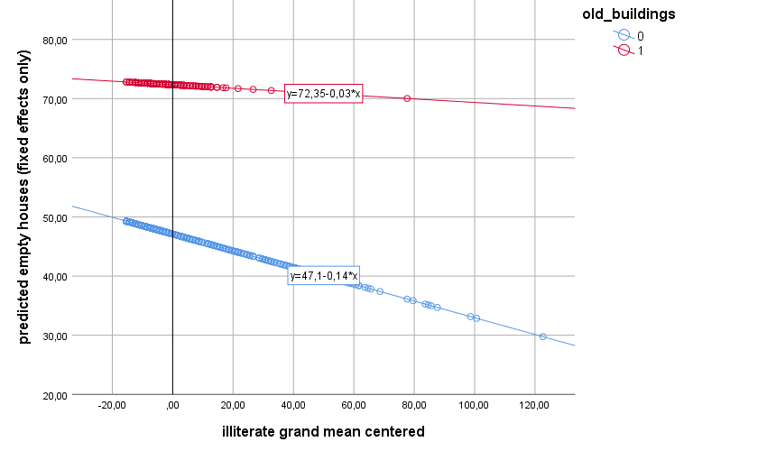

# 5. Interaction Effects and Centering   
Let’s do model 5!  

For this model our predictors will be *illiterate* (a covariate variable) and *old_buildings* (a categorical variable/factor indicating whether or not there are a lot of old building in a parish). Here we will ignore the within/between effect difference for *illiterate* and focus on the overall effect (without disaggregation). As a recap, the *illiterate* variable refers to level 1 units (sections) and the the *old_buildings* factor refers to level 2 units (parishes).  

In this model we will add both variables as predictors - one goes to the **Covariate(s) box** in the **Linear Mixed Models dialog box**, the other to the **Factor(s) box**. We will test the main effects of both predictors as well as their interaction to see if *illiterate* effects vary depending on whether or not there are a lot of old buildings (why not?).  

Summing up, 4 fixed effects: intercept, *illiterate*, *old_buldings*, and *illiterate x old_buildings*. See **figure 5.1** if you don’t know how to create the interaction effect in the **Linear Mixed Models: Fixed Effects dialog box**. Use the **Linear Mixed Models: Save dialog box** to ask for the **Predicted values (Predicted Values box)**. Add the random effect of *intercept* without a random slope (so this is a 2 level random intercept model).  

By the way, an interaction between a level 1 variable and a level 2 variable is called a cross level interaction.

**Figure 5.1**. *Adding an interaction effect*.  
&nbsp;  

Take a look at the estimates of the fixed effects (**figure 5.2**). Finally the *p* values of the F tests (the ANOVA like table) and the t tests (regression like table) differ. It’s not good, nor bad, it just is. I’ll try to explain why this is.   

Type III F tests, test the significance of main and interaction effects while controlling for the effects of other variables. The regression t test, tests whether a predictor effect is significantly different from 0, while the scores of other predictors are set to 0 (0 for categorical variables means the reference category).  

Hang in there. With this is mind, do you understand what the intercept fixed estimate represents (**72.809**)? This is the estimated mean number of empty houses, for (a) sections with 0 illiterate residents, and for (b) the reference category of old_buildings (here old_buildings = 1 is the reference category; confusing I know).So 72.809 is actually the estimated number of empty houses in parishes with a lot of old buildings (old_buildings = 1) and 0 illiterate residents.  

**Figure 5.2**. *Model 5: estimates of fixed effects*.   
&nbsp;  

Let’s make plots to dig into this a little further. Please, plot the empty houses predicted values (*FIXPRED_* variable) against the *illiterate* scores, and use *old_buildings* to colour your dots (**figure 5.3**).

**Figure 5.3**. *Model 5: predicted empty houses scores (fixed effects only)*.   
&nbsp;  

Let’s dissect this graph. There’s a vertical line crossing the plot I know, just ignore it for now. Can you match the values in the two regression equations with the fixed regression estimates in the fixed effects table (**figure 5.2**)?   

Matches (plot vs. table):   
1. **red line intercept** (old buildings - 1) = **intercept estimate** = **72.81**   
2. **blue line intercept** (old buildings – 0) = **intercept estimate + [old_buildings=0] estimate** = 72.81 + (-23.54) = **49.27**
  * Also: **-23.54** represents the **estimated mean difference (of empty houses) between the old_buildings two levels (1 vs 0), when then number of illiterate residents is 0**   
3. **red line slope** = **illiterate estimate** = **-.03**   
  * Also: **-.03** estimate **is not an estimate of the main effect** of the *illiterate* covariate (as in the ANOVA like table), but it **is actually a simple main effect** (the effect of the illiterate covariate within one specific level of old_buildings); this is why the *p* values in the two tables differ – they are testing two different things   
4. **blue line slope** = **illiterate estimate + [old_buildings=0] x illiterate estimate** = -.03 + (-.11) = **-.14**   
&nbsp;  

That pretty much covers it. But… can we get the same *p* values for the F test and t test for this example? YES WE CAN!   
&nbsp;  

## Centering
To recap, centering means you subtract some value from every score in you variable. In **grand mean** centering you subtract the sample mean from every score (go to **Analyze > Descriptive Statistics** to get the sample mean, and then use **Transform > Compute** to create a new centered variable). This new grand mean centered variable will have a mean of 0. We have this variable already in the dataset- it’s call *illiterate2*.   

I know it will sound weird but we can also center categorical variables (*Manny say what?!?*). Use the **Transform > Recode into Different Variables command** to create a new variable called *old_buildings2*. Recode all **0s to -0.5s and 1s to 0.5s**. You can use a different coding scheme, the important part is that the midpoint between both values has to be? Want to guess? ZERO that’s right! One more thing: check in the **Variable View** pane that *old_buildings2* is now a **Scale Measure** (continuous) and not a **Nominal Measure**, please.   

By adding *old_buildings2* as a covariate to the model instead of *old_buildings* as a factor, the *illiterate* fixed effect estimate will still be the estimated effect when *old_buildings2* equals 0. But  now 0 doesn’t represent any of the levels (very non-Solomonic - *“Give the baby to her, just don't split him”*)… Again, but now 0 doesn’t represent any of the levels the *illiterate* estimate, as such, it is now a main effect and not a simple main effect.  

So if you rebuild model 5 with *old_buildings2* as a covariate instead of *old_buildings* as a factor you’ll get twin *p* values for the F and t tests.  
&nbsp;  

You can try this at home, but while we are at it, let’s kill two rabbits with one stone. Create a new model (**model 6**), where you replace both *old_buildings* (factor) and *illiterate* (covariate), with *old_buildings2* and *illiterate2* (both covariates). Don’t forget the interaction. Do the model and plot the predicted values (*FIXPRED_* variable from **Predict values – Fixed Predicted Values, Save dialog box**) against *illiterate2* and colour the dots with *old_buildings2*.   

First check that the fixed effects tables show the same *p* values for the same effects, then take a look at the plot (**figure 5.4**) and compare it with **figure 5.3**. You can see that the centering did not change the slope lines – the number of empty houses associates in the same manner with the number of illiterate residents in the two types of parishes. **But it changed the intercepts**. The vertical axis in **figure 5.4** now stands on the place of the **black vertical line** in **figure 5.3** (this line crosses figure 5.3 plot at the sample mean illiterate score – I put it there on purpose!). Summing up, centering covariates shifts the vertical axis, and consequently the intercepts' fixed estimates.  

Imagine that we shift the vertical axis continuously to the right. What happens? If we do this, the distance between the points where both lines cross the vertical axis continuously increases. In other words, if we shift the vertical axis to the right, the difference between intercepts gets bigger and bigger. So, where you choose to place your vertical axis affects the estimate of the *illiterate* regression estimate, and consequently the *p* value associated with it. Always remember that the **regression estimates are predicted values when all the remaining predictors are equal to 0**.   

One more interesting thing I want to show you. Come with me.   

Compare the intercept estimates, t tests and F tests for the interaction effects of both models. They are the same! They didn’t move an inch with centering. So if you’re only interested in interaction effects, forget about centering. But if you are interested in more than just the interactions, the take home message is: you have to think carefully what you want 0 to represent for your predictor, so you know (a) how to interpret regression estimates and know (b) why the F test and t tests might give you different *p* values.

**Figure 5.4**. *Model 6: predicted empty houses scores (fixed effects only)*.   
&nbsp;  
