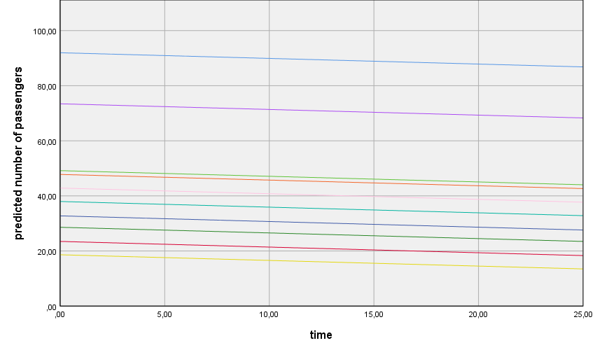
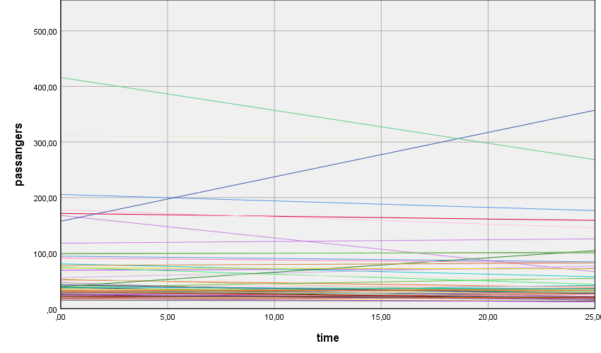
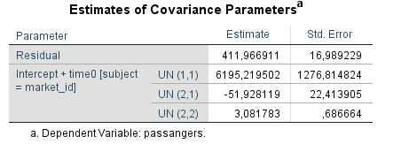

# 7. Longitudinal Data / Repeated Measures
Repeated measures data, which includes longitudinal data, is just another type of multilevel data. You have different observations nested within subjects. Here observations are level 1 data, and subjects level 2 data. You can use everything we learned so far about 2 level models to model repeated measures data.  

Before we continue, I just want to give you my explanation why there’s a slash between longitudinal data and repeated measures. For those of you coming from experimental psychology you probably associate repeated measures to data collected from different conditions in an experiment (say, cond1, cond2, and cond3) that all participants have to go through. But not all participants go through these conditions in the same order – you generally randomize the order of the conditions to control for order effects. So one participant does, cond3, cond2 and cond1, other does cond2, cond1, cond3, etc, etc…   

For those of you coming from, say, from educational psychology you should be working to close down all schools in the world and you probably associate repeated measures to data collected at different points in time (say, time1, time2, time 3). Here you can’t randomize the order of time (the universe would collapse if you do).   

So what does this time cond thing mean? If you correlate time 1 to time 2 measures they are more likely to be correlated, because they always come one after the other, than cond 1 to cond 2 measures. This peculiarity of longitudinal data can really get you going on the path to very complex models. In this case, complex equals, adding a lot of random parameters to your models. To add a lot of random parameters you need a lot of repeated observations. In practice what this means is that even if you know there’s a more complex model you could fit, where you make the least possible assumptions, your data cannot “support” such megalomaniac dreams. As someone said: *“One is looked upon as more mature when they are acting in accordance with reality”* – the psychodynamic reality principle can take you a long way in analysing data.   

To give you a quick example, I’ll ask to you remember our hypothetical daily collection of mood scores. Imagine we collected data during 10 consecutive days. Do you think your day 1 and day 2 scores are as correlated as your day 1 and day 10 scores? Probably not, 2 observations close in time are more likely to be correlated than 2 observations more spread apart. So if you want to account for this, you have to let the correlation/covariance between two consecutive observations be different, from the correlation between observations separated by two days, from the correlation between observations separated by three days, etc, etc… All these different covariances, if you let them vary, each count as 1 more random parameter you’ll have to estimate. Usually we’ll just have to assume that all these covariances are the same. Further, you can even let the variance of day 1 scores to be one thing, the day 2 scores variance to be another thing, etc, etc… more random parameters. Usually we’ll just have to assume that all these variances are the same (the famous homogeneity of variance assumption). Don’t be sad, there’s still a lot of cool stuff that we can do. I’ll give you the basics, afterwards you can fly solo.  
&nbsp;  

## 7.1. The longitudinal null model (sometimes called the unconditional growth model)
Talking about flying, you can download a new dataset here: [planes.sav](/data/ch7/planes.sav). This data was retrieved from (http://users.stat.ufl.edu/~winner/data/longair.dat). I’ve selected only a partial sample of the original dataset. Briefly, this dataset includes 26 quarterly records (*time*: 1 to 26) of the mean number of passengers (*passengers*), flown to 49 different markets (*market_id*; level 2 identifier).  

Before we start building the model let’s center our time predictor. The time scores range from 1 to 26. In longitudinal models is a good idea to center time on the first observation. This way intercepts equal estimated means at time = 0 (our first data point). Use the **Transform > Compute Variable** command to get a time0 variable (just subtract 1 from *time* variable).   

The difference between the longitudinal null model and the level 2 null model is that the longitudinal null model includes 1 fixed predictor (*time*) to start with. You can build your first longitudinal model following the same steps we have used before. Just add *time0* as a covariate and add its main effect to the model. Don’t forget to ask the **Predicted Values (Predicted Values & Residuals)** to plot the growth trajectories of the different markets. Plot the *PRED_* variable against *time0* and colour the points according to their *market_id*.   

**Figure 7.1.1** shows us the linear growth trajectories of 10 different markets. Because this is a random intercept model, all growth trajectories start at different points but have the same growth rate. The *time0* estimate tells you how much the number of passengers change from one time point to the other.

**Figure 7.1.1**. *Linear growth trajectories: time fixed slope*.   
&nbsp;  

### Random intercept and time slope model: uncorrelated random effects
Now as we did before, just add a *time0* random slope- in the **Linear Mixed Models: Random Effects dialog box** just move *time0* into the *Model* box. This allows the growth trajectories to vary between markets. That becomes evident when you look at **figure 7.1.2**.   

**Figure 7.1.2**. *Longitudinal random intercept and time slope model: time random slope*.   
&nbsp;  

### Random intercept and time slope model: correlated random effects   
Let’s relax another assumption (add more random paremeters that is). In the previous model, time slopes are considered to be independent of random intercepts. What this means is that the growth trajectories are independent of the starting point – whether you start high or low doesn’t affect your growth (the American dream). Let’s see if this is in fact the case. To do this, just go to the **Linear Mixed Models: Random Effects dialog box** and change the **Covariance Type** from **Variance Components** to **Unstructured**. There’s a lot to say about these options, but not today. Remember the example above about the daily mood scores? This is where you deal with that stuff about non-homogeneous covariances and variances.   

I’ll leave the plot for you this time. I want to show you other things. First, you can use the difference in deviances from the last two models to see if allowing the time random slope and random intercept to co-vary improves model the fit (please see **section 4.1** to remember how to compare model fit). The deviance difference is **6.705** (check the Information Criteria tables first row), and the number of different random effects is 1 (the covariance between random intercept and random slope). 6.705 is higher than 3.84 (chi-square: 1 df, *p* = .95); as such, relaxing the assumption of uncorrelated random effects improved the model fit.   

The second thing I want to show you is the random effects table (**figure 7.1.3**). Can you see the three rows with the UN letters? UN (1,1) is the random intercept variance, UN (2,2) is the random slope variance, and UN(1,2) is the covariance between the random intercept and the random time slope. Memorize: (a) equal numbers inside parenthisis refer to variances, (b) different numbers refer to covariances.   

UN(1,2) has a negative estimate (**-51.93**), indicating a negative association between both random effects. This can be interpreted as: markets that receive more passengers at time = 0 (first data point in our case) tend to grow less than their counterparts, or if you prefer the other way around, markets that receive less passengers at time 0 tend to growth more than their counterparts. On average, high and low starters tend to regress towards the mean, that's what it means.

**Figure 7.1.3**. *Estimate of random intercept and random time slope covariance*.   
&nbsp;  

### How to make SPSS crash and at the same time get an intuitive feel of what the different types of covariance structures mean in terms of model assumptions   
In the previous models we considered time as a covariate. What this does is that it makes the rate of change constant – the amount of change from time 0 to time 1 is the same as the change from time 1 to time 2, from time 2 to time 3, on and on and on… If you enter time as factor you will be able to estimate different rates of change for every time step. Because we have 26 different time points, this will add 25 fixed predictors to the model. You can use deviances again to compare whether this is better than simply using a time covarite. If you do this, you'll be comparing two models that differ only on the fixed part (one has 24 more parameters than the other: 1 time estimate in one case, 25 in the other), and so you should use ML estimation and not REML (go back to **section 4.1** to get a recap).

Next, to get a feel about the different types of covariance structures you can fit to your data and what do they mean, you can estimate the same model, over and over again, with different **Covariance Types**. Do one thing first – in the **Linear Mixed Models: Statistics dialog box** check the **Covariances of random effects checkbox**. If you do this, you'll get a new large table in your output. This is a covariance matrix telling you what your model estimates or sets at a speficic value (if it is set/fixed you're assuming something even if you don't think about it).   

The diagonal of this matrix refers to the variances. Off-diagonal values refer to the covariance of two effects. If you explore a bit you will see in some cases a lot of zeros. This is the most strict assumption. Other times you’ll see a lot of equal non-zero values – this is a less strict assumption. This least strict option of them all will reveal a lot of different numbers (if your SPSS doesn’t crash meanwhile). If you want to play, this is a good time to save something you might want to give to your future self. While you play, also take a look at the number of random effects your model estimates – the more it does, the more relaxed it is, the more it respects the true nature of your data, the more time to estimate it will take, the more likely it will throw errors and warnings at you.